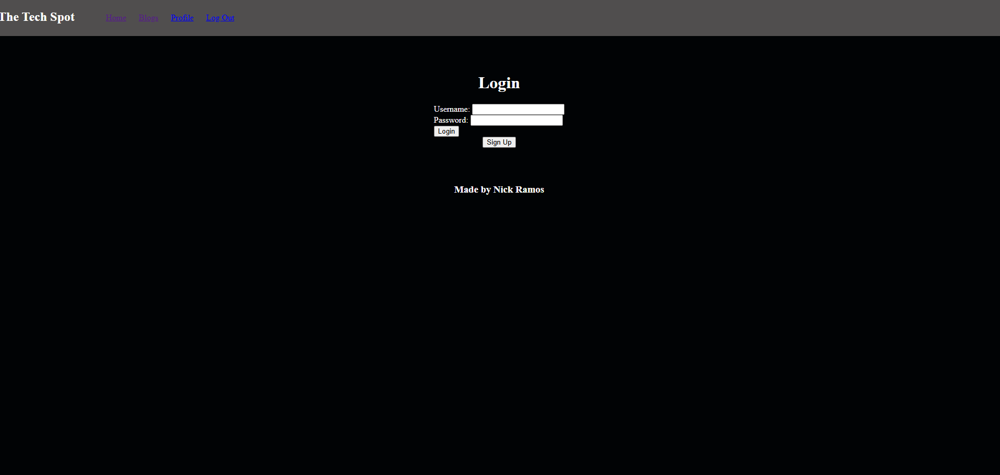
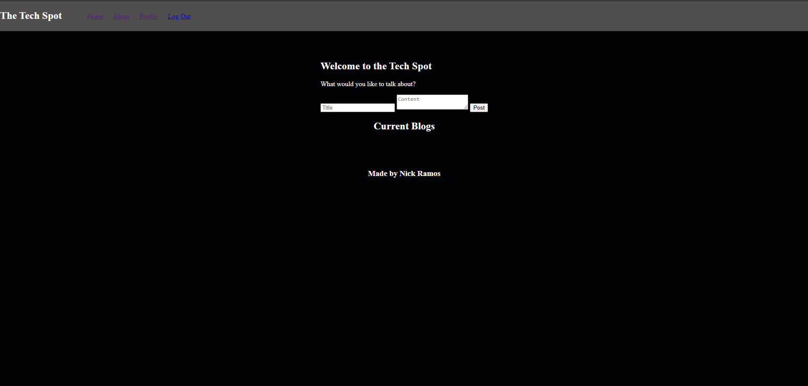
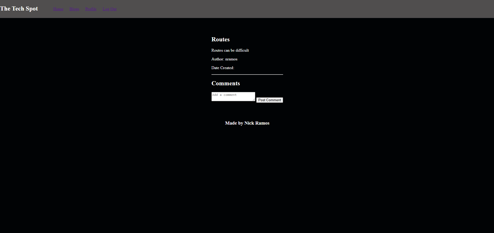

# Tech Blog

## Table of Contents
* [Description](#description)
* [Github](#github)
* [Deployed_Page](#deployed-page)
* [Website_Screenshots](#website-screenshots)
* [Installation](#installation)
* [Usage](#usage)
* [License](#license)
* [Contributing](#contributing)

## Description

A blog designed to allow discussion about tech issues.

## Github
 

* Link to Github: https://github.com/nramos9071/challenge-14

## Deployed Page

https://challenge-14-g18m.onrender.com 

## Website Screenshots

## Installation
Postgres, Express, Sequelize, Dotenv.

 
## Usage
This blog is used to be able to discuss tech issues with a community of other coders. With this page you can create a user, post a blog, search through the collection of blogs, view your profile, and delete your account if you no longer wish to post. 
 
## License
N/A
 
## Contributing
Code Created by: Nick Ramos with code contributed by CoPilot.